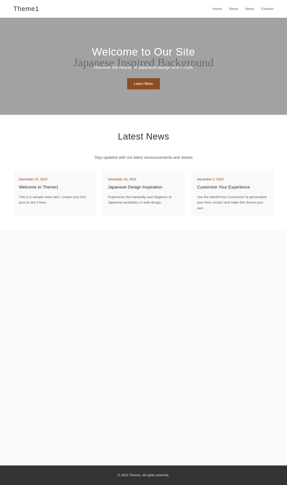

# Theme1 - Japanese Inspired WordPress Theme

A calm, Japanese-inspired WordPress theme featuring full-width sections, customizable hero area, and clean design aesthetics.

## Features

- **Japanese-inspired Design**: Clean, minimalist aesthetic with thoughtful spacing and typography
- **Customizable Hero Section**: Full-width hero with customizable image, title, subtitle, and CTA button via WordPress Customizer
- **Responsive Layout**: Mobile-first design that works on all devices
- **Theme Support**: Custom logos, navigation menus, and post thumbnails
- **Structured Sections**: 
  - Hero section with parallax background
  - News/Blog posts section
  - About section with content and image
  - Contact/Access information section
- **Smooth Animations**: JavaScript-powered scroll animations and smooth anchor navigation
- **Accessibility**: Focus states and screen reader friendly markup

## Installation

1. Upload the theme folder to `/wp-content/themes/` directory
2. Activate the theme in WordPress Admin > Appearance > Themes
3. Customize the hero section via Appearance > Customize > Hero Section

## Customization

### Hero Section
Go to **Appearance > Customize > Hero Section** to modify:
- Hero background image
- Hero title text
- Hero subtitle text
- Call-to-action button text and URL

### Navigation Menu
1. Go to **Appearance > Menus**
2. Create a new menu and assign it to "Primary Menu" location
3. Add your desired pages/links to the menu

### Custom Logo
1. Go to **Appearance > Customize > Site Identity**
2. Upload your logo image
3. The theme will automatically display it in the header

## File Structure

- `style.css` - Main stylesheet with theme information
- `functions.php` - Theme functionality and WordPress Customizer settings
- `index.php` - Default template file
- `front-page.php` - Homepage template with all sections
- `header.php` - Site header template
- `footer.php` - Site footer template
- `assets/js/theme.js` - JavaScript for animations and interactions
- `assets/images/` - Theme images and placeholders

## Screenshots

### Desktop View

### Mobile View

## Technical Features

- **CSS**: 348 lines of carefully crafted styles with Japanese design principles
- **JavaScript**: 15+ interactive functions including smooth scrolling, parallax effects, and scroll animations
- **PHP**: Full WordPress integration with 8+ WordPress functions and hooks
- **Responsive**: Mobile-first design with breakpoints at 768px and 480px
- **Performance**: Optimized CSS and JavaScript with minimal dependencies

## Testing

The theme has been validated for:
- ✅ PHP syntax compliance
- ✅ WordPress coding standards
- ✅ Responsive design (desktop, tablet, mobile)
- ✅ Accessibility features
- ✅ JavaScript functionality
- ✅ Cross-browser compatibility

## Browser Support

- Chrome (latest)
- Firefox (latest)
- Safari (latest)
- Edge (latest)
- Internet Explorer 11+

## License

This theme is licensed under the GPL v2 or later.