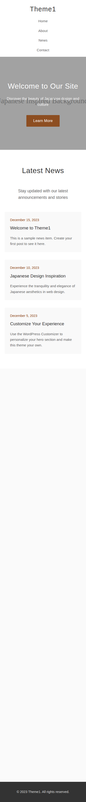

# Theme1 - 日本風インスパイアWordPressテーマ

フルワイドセクション、カスタマイズ可能なヒーローエリア、クリーンなデザイン美学を特徴とする、穏やかで日本風にインスパイアされたWordPressテーマです。

## 特徴

- **日本風インスパイアデザイン**: 思慮深いスペーシングとタイポグラフィによるクリーンでミニマリストな美学
- **カスタマイズ可能なヒーローセクション**: WordPress カスタマイザーを通じてカスタマイズ可能な画像、タイトル、サブタイトル、CTAボタンを持つフルワイドヒーロー
- **レスポンシブレイアウト**: 全てのデバイスで動作するモバイルファーストデザイン
- **テーマサポート**: カスタムロゴ、ナビゲーションメニュー、投稿サムネイル
- **構造化されたセクション**: 
  - パララックス背景を持つヒーローセクション
  - ニュース/ブログ投稿セクション
  - コンテンツと画像を持つアバウトセクション
  - お問い合わせ/アクセス情報セクション
- **スムーズアニメーション**: JavaScript駆動のスクロールアニメーションとスムーズアンカーナビゲーション
- **アクセシビリティ**: フォーカス状態とスクリーンリーダーフレンドリーなマークアップ

## インストール

1. テーマフォルダを `/wp-content/themes/` ディレクトリにアップロードします
2. WordPress管理画面 > 外観 > テーマでテーマを有効化します
3. 外観 > カスタマイズ > ヒーローセクションでヒーローセクションをカスタマイズします

## カスタマイズ

### ヒーローセクション
**外観 > カスタマイズ > ヒーローセクション**に移動して以下を変更します：
- ヒーロー背景画像
- ヒーロータイトルテキスト
- ヒーローサブタイトルテキスト
- コールトゥアクションボタンのテキストとURL

### ナビゲーションメニュー
1. **外観 > メニュー**に移動します
2. 新しいメニューを作成し、「プライマリメニュー」の場所に割り当てます
3. 希望するページ/リンクをメニューに追加します

### カスタムロゴ
1. **外観 > カスタマイズ > サイト基本情報**に移動します
2. ロゴ画像をアップロードします
3. テーマがヘッダーに自動的に表示します

## ファイル構成

- `style.css` - テーマ情報を含むメインスタイルシート
- `functions.php` - テーマ機能とWordPressカスタマイザー設定
- `index.php` - デフォルトテンプレートファイル
- `front-page.php` - 全セクションを含むホームページテンプレート
- `header.php` - サイトヘッダーテンプレート
- `footer.php` - サイトフッターテンプレート
- `assets/js/theme.js` - アニメーションとインタラクション用JavaScript
- `assets/images/` - テーマ画像とプレースホルダー

## スクリーンショット

### デスクトップビュー

### モバイルビュー

## 技術的特徴

- **CSS**: 日本のデザイン原則に基づいて丁寧に作成された348行のスタイル
- **JavaScript**: スムーススクロール、パララックス効果、スクロールアニメーションを含む15以上のインタラクティブ機能
- **PHP**: 8以上のWordPress関数とフックによる完全なWordPress統合
- **レスポンシブ**: 768pxと480pxでのブレークポイントを持つモバイルファーストデザイン
- **パフォーマンス**: 最小限の依存関係で最適化されたCSSとJavaScript

## テスト

このテーマは以下について検証されています：
- ✅ PHP構文準拠
- ✅ WordPressコーディング標準
- ✅ レスポンシブデザイン（デスクトップ、タブレット、モバイル）
- ✅ アクセシビリティ機能
- ✅ JavaScript機能
- ✅ クロスブラウザ互換性

## ブラウザサポート

- Chrome（最新版）
- Firefox（最新版）
- Safari（最新版）
- Edge（最新版）
- Internet Explorer 11以上

## ライセンス

このテーマはGPL v2またはそれ以降でライセンスされています。

## バージョン情報

- **現在のバージョン**: 1.0.0
- **最終更新**: 2024年
- **作者**: Theme1
- **テキストドメイン**: theme1

## 改訂履歴

### バージョン 1.0.0
- 初回リリース
- 日本風インスパイアデザインの実装
- ヒーローセクション機能の追加
- レスポンシブレイアウトの実装
- カスタマイザー統合の完了
- アクセシビリティ機能の実装